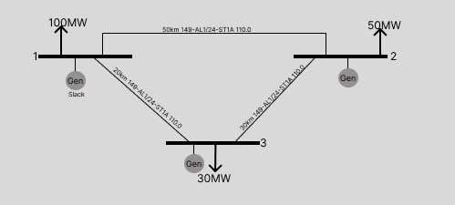

# 3Bus Energy System Topology for an OPF example

A simple proof of concept of an energy blockchain with the usage of pandapower and power network topology from scratch

## Description

An Optimal Power Flow solution based with the usage of a python library for network solving.
Official Documentation of pandapower could be found [here](https://pandapower.readthedocs.io/en/v2.2.0/index.html)

## Table of Contents

- [3Bus Energy System Topology for an OPF example](#3bus-energy-system-topology-for-an-opf-example)
  - [Description](#description)
  - [Table of Contents](#table-of-contents)
  - [Installation and Usage](#installation-and-usage)
  - [Features](#features)
  - [Notebooks](#notebooks)
  - [Future Work](#future-work)
  - [Contact](#contact)

## Installation and Usage
The system should have a latest version of python

Clone the current repository or download as a .zip

Run ```pip install pandapower["all"]```

And the navigate to "main.ipynb"


## Features 

The below network is been modelled with the help of pandapower and a simple simpulation of an Optimal Power Flow have run.
Pandapower is a fast an interactive way to create topologies from scratch and it is also compatitable with Matpower for the import of export to the desired format.
 
The solution was stored to ```.json``` format and in ```.mat``` format as a Matpower compatitable and could be found under the ```saved-topologies``` folder.

Below is been represented a visual representation of the network.

Moreover pandapower supports ```Julia || .jl``` with the usage of Python as interface for the Optimization of Power System Problems.\
Official Documentation could be found [here](https://pandapower.readthedocs.io/en/v2.0.1/opf/powermodels.html)



## Notebooks

The `main` notebook creates the 3-bus topology.\
The `Economic-Dispatch` formulates the economic problem to a linear programming problem and solves it.\
The `PTDF_LODF` computers the matrices of the Power Transger Distribution Factors and Line Outage Distribution Factors.

## Future Work

Step-3 as it is said.


## Contact

[Nick Koutantos](https://nikolaoskoutantos.com/)
